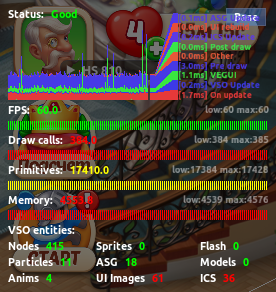

# imgui_perfmon
Simple performance widget for ImGUI

## Description

PerfmonWidget is a real-time performance monitoring widget for applications. It provides the following capabilities:

- **Metrics Tracking** - monitoring time series data with configurable threshold values
- **Graph Visualization** - colored time graphs with performance status indicators (good/normal/bad)
- **Profiler** - built-in profiler with execution timeline visualization
- **Entity Counters** - tracking counts of objects, entities, and other countable metrics
- **Overall Status** - aggregated performance assessment of the system
- **Baseline Comparison** - ability to compare current metrics against a baseline

The widget integrates easily into any ImGui-based application and provides a convenient interface for monitoring critical performance metrics.

## Example

For usage example, see: [main.cpp](https://github.com/zenkovich/imgui/blob/f4baf35d8e4d7fbc9a4557eb8d679e7dc7dfe050/examples/example_win32_directx9/main.cpp#L98)

